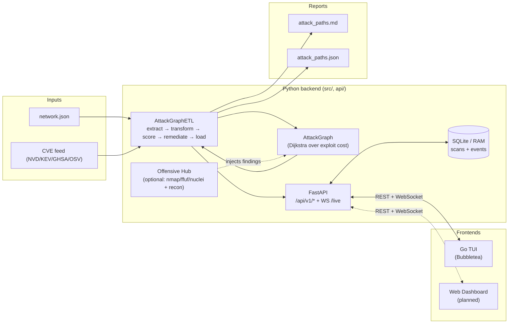

# ⚔️ Gordian 

[](https://www.python.org/downloads/)
[](https://opensource.org/licenses/MIT)
[]()

```text
         /\
        /  \
       |    |
       |    |
     __|____|__        ____               _ _             
    [==========]      / ___| ___  _ __ __| (_) __ _ _ __  
        |  |         | |  _ / _ \| '__/ _` | |/ _` | '_ \ 
     o--|--|--o      | |_| | (_) | | | (_| | | (_| | | | |
    / \ |  | / \      \____|\___/|_|  \__,_|_|\__,_|_| |_|
   o---o|--|o---o  
  / \ / |  | \ / \ 
 o---o  |  |  o---o    
  \ / \ |  | / \ / 
   o---o|--|o---o  
    \ / |  | \ /   
     o--|--|--o    
        |  |       
        \  /       
         \/

```
> A reasoning layer for vulnerability management that turns flat CVE lists into prioritized risk reduction.

Reads a network topology and an enriched CVE feed, builds a weighted attack graph, and finds the most probable multi-hop paths from an external attacker to your crown-jewel hosts. Then, it simulates patching to tell you **which CVE to patch first to break the most kill chains**.

*Note: Core ETL stays non-exploitative. Optional Offensive Integration Hub can orchestrate your installed Nmap/ffuf/Nuclei tools to enrich the graph in real time.*

## Security and authorized use

Use Gordian's offensive hub only on systems you own or have explicit written authorization to assess. Define the permitted targets, testing window and rate limits before running tools. Discovery of a host does not grant permission to scan it. You are responsible for complying with the engagement scope and applicable law. Findings, credentials and scan reports are sensitive; keep them out of public repositories. Risk scores are prioritization heuristics, not proof of exploitability or a security guarantee.

### Current operating boundary

- The API and Go TUI are the supported control plane. The React dashboard is an explicitly labelled **demo preview** with synthetic graphs and local-only controls.
- Set `GORDIAN_API_KEY` to the same randomly generated secret of at least 32 characters in the backend and TUI environments. Every API data/control route and event socket requires authentication. Keep the service on loopback; remote access requires a trusted TLS reverse proxy and restricted network access.
- Live API scans require a server-owned `--scope-file`. An empty allowlist denies all targets. Whole CIDRs, deny overlaps, discovered follow-up targets and resolved addresses are checked. Scanner redirects, DNS changes and tool-internal discovery still require OS/network egress isolation; scope checks are not a sandbox.
- API clients cannot select executables, arbitrary flags, command templates, interactive full-control mode, or unrestricted filesystem paths. Configure installed tools on the server. Core Python command overrides are trusted operator code with the privileges of the Gordian process.
- API datasets must be JSON files under `data/`; request wordlists must be under `data/wordlists/`. Per-scan reports go under `reports/<scan-id>/`. Remote CVE syncing is not supported by this API version; use prepared local feeds.
- Raw command arguments and raw tool lines are withheld from public event/report serialization. Redaction is best effort for interpreted findings; treat every report as private evidence.

Generate a local key in PowerShell before starting the backend (then provide the same key to the TUI process without committing it):

```powershell
$env:GORDIAN_API_KEY = python -c "import secrets; print(secrets.token_urlsafe(32))"
python main.py --headless --offensive-disable
```

This starts the authenticated API with active tooling disabled. A REST request or the Go TUI starts analysis. For an authorized live engagement, configure `--scope-file` and omit `--offensive-disable`.

Development tests require `pip install -r requirements-dev.txt`. Runtime dependencies are pinned in `requirements.txt`; re-audit them before each release. Go builds require Go 1.26.6 or newer.

### Public release gate

Before each public release, complete all checks below and treat them as a hard gate:

- [ ] Security baseline files exist and are current: `LICENSE`, `SECURITY.md`, `.env.example`, `.gitleaks.toml`.
- [ ] Dependency audits pass (`pip_audit`, `npm audit`, `govulncheck`) in CI.
- [ ] Working tree secret scan passes:
  - `gitleaks dir . --config .gitleaks.toml --redact`
- [ ] Full Git history secret scan passes:
  - `gitleaks git . --config .gitleaks.toml --redact --log-opts=--all`
- [ ] Reports/data/manual review passes: no customer identifiers, environment-specific hosts/IPs, credentials, or private evidence is present in publishable files.

If any real credential is detected in current files or history, rotate it immediately, revoke old access, and rewrite history before publication. Deleting files alone is insufficient.

False positives must be handled through narrowly scoped rules in `.gitleaks.toml` with justification comments; do not suppress findings globally.

---

## 📑 Table of Contents

- [Why this exists](#-why-this-exists)
- [Key Features](#-key-features)
- [How it Works (The Pipeline)](#-how-it-works-the-pipeline)
- [Architecture](#-architecture)
- [Installation & Requirements](#-installation--requirements)
- [Usage](#-usage)
- [Example Output](#-example-output)
- [Sample Scenario](#-sample-scenario)
- [Project Layout](#-project-layout)
- [Future Roadmap](#-future-roadmap)
- [License](#-license)

---

## 💡 Why this exists

I kept reading about attack-path and attack-graph tooling and wanted to work through the underlying problem myself before reaching for a graph library or a commercial product. The algorithm is simple; the interesting parts are the edge-cost heuristic, the scoring, and answering the critical question: *"Which patch buys me the most risk reduction?"* So, I wrote those out.

## ✨ Key Features

- **Lean Runtime Dependencies:** Python 3.11+ core with optional dashboard streaming powered by `aiohttp`.
- **Dijkstra-based Pathfinding:** Finds the most probable/cheapest attack paths, not just the ones with the fewest hops.
- **Smart Scoring:** Blends CVSS, EPSS, weaponization status, and target criticality into a composite risk score (0-100).
- **Patch Simulation:** Identifies "chokepoint" vulnerabilities that, when patched, break multiple kill chains—often surfacing lower-CVSS bugs that are critical for lateral movement.
- **CI/CD Ready:** Can be used as a gate in CI pipelines to fail builds if unpatched kill chains exist.
- **Offensive Integration Hub (Optional):** Async orchestration of Nmap/ffuf/Nuclei plus optional recon adapters (Subfinder, Amass, BBOT, Katana, HTTPX, SecretFinder, LinkFinder, Gitleaks, Aquatone, Gowitness) with live output parsing, graph injection, and plain-language narratives.

## ⚙️ How it Works (The Pipeline)

Two JSON inputs go in:
1. **Network Topology:** Hosts, exposed services, and firewall/segmentation rules (which host/port can reach which).
2. **CVE Feed:** CVSS, EPSS, MITRE ATT&CK mapping, and whether the exploit is weaponized in the wild.

The internal process:
1. **Extract** — Async JSON load, processing both feeds in parallel.
2. **Transform** — Build a directed weighted graph. An edge `A -> B` exists only if `A` can reach `B` on a specific port, `B` has a service listening on that port, and that service exposes a CVE.
3. **Pathfind** — Run Dijkstra's algorithm over the exploit cost, from each attacker entry point to each crown jewel.
4. **Score** — Generate a 0-100 composite risk score per chain, applying hop penalties and factoring in target value.
5. **Remediate** — Simulate patching each CVE in a chain (drop it, rebuild graph, re-run pathfinder) and measure the aggregate risk reduction to rank patches.
6. **Load** — Write JSON and Markdown reports, and pretty-print a summary to the console.

Optional runtime extension:
7. **Offensive Integration Hub** — Build safe tool commands from JSON/CLI config, run tools concurrently via `asyncio.create_subprocess_exec`, parse output line-by-line, inject new graph edges/nodes, and stream live events for dashboards.

## 🏛 Architecture



**Component map:**

| Layer | Path | Role |
|---|---|---|
| Core engine | [src/transformers.py](src/transformers.py), [src/scoring.py](src/scoring.py), [src/remediation.py](src/remediation.py) | Build graph, run Dijkstra, score chains, simulate patches |
| Pipeline | [src/orchestrator.py](src/orchestrator.py) | Async ETL wiring with progress + live-log hooks |
| CVE sourcing | [src/cve_sources.py](src/cve_sources.py), [src/cve_filtering.py](src/cve_filtering.py) | NVD / CISA KEV / GHSA / OSV fetch + asset-aware filtering |
| Offensive hub | [src/offensive/](src/offensive/) | Tool orchestration, scope policy, parsers, finding injection, storyteller |
| API | [api/app.py](api/app.py), [api/routes.py](api/routes.py), [api/state.py](api/state.py) | FastAPI server, scan lifecycle, WebSocket broadcast |
| Storage | [api/storage.py](api/storage.py) | SQLite (WAL) or in-memory backend for scan + event history |
| TUI | [tui/](tui/) | Bubbletea terminal UI: dashboard, map, config, live log |
| Reports | `reports/attack_paths.{md,json}` | Operator-facing output |

**Runtime entry points:**
- `python main.py` — starts the FastAPI server (default loopback bind on `127.0.0.1:8000`). Start the Go TUI separately with `go run ./cmd/gordian` from `tui/`.
- `python main.py --headless` — backend only, no boot animation.
- `GORDIAN_API_KEY=…` — mandatory random secret of at least 32 characters; used for REST and event-socket authentication.
- `GORDIAN_CORS_ORIGINS=https://x,https://y` — override loopback-only CORS default.

## 🚀 Installation & Requirements

**Requirements:** Python 3.11+
*Optional dashboard mode requires `aiohttp`.*

Clone the repository and run the tests to ensure everything is working:

```bash
git clone https://github.com/oxyec/gordian.git
cd gordian

# Optional: Run tests using pytest
pip install -r requirements-dev.txt
python -m pytest -v
```

## 💻 Usage

`main.py` configures and starts the API; it does not launch a one-shot scan. Start scans through the authenticated Go TUI or `POST /api/v1/scan/start`. The CLI examples below describe backend configuration. Arbitrary tool command/argument overrides and remote CVE sync settings are not supported by the hardened API; legacy advanced controls may return a validation error. Use local feeds and server-owned scope/tool configuration.

Run the CLI using the `main.py` entry point. It defaults to using the bundled sample data.

```bash
# Full run on bundled sample data
python main.py

# CI gate: Exit with status code 2 if any kill chain is found
python main.py --fail-on-findings

# Skip patch-priority analysis (faster on large graphs)
python main.py --no-remediation

# Just write reports, suppress console output
python main.py --quiet

# Point to your own custom data files
python main.py --network /path/to/network.json --cves /path/to/cves.json --out /path/to/reports

# Show available CVE feed profiles
python main.py --list-cve-profiles

# Auto-sync latest CVEs from a selected source profile
python main.py --cve-profile nvd_recent

# Merge latest NVD + CISA KEV into one dynamic feed
python main.py --cve-profile all_latest --cve-max-items 2500

# Pull recent GitHub advisories (GHSA) normalized into CVE rows
python main.py --cve-profile ghsa_recent --cve-max-items 1500

# Extended merge: NVD + CISA KEV + GHSA with optional OSV enrichment
python main.py --cve-profile all_plus --cve-max-items 3000 --cve-osv-lookup-limit 120

# Multi-source merge priority (highest first): GHSA > CISA > NVD > OSV
python main.py --cve-profile all_plus --cve-source-priority ghsa_recent,cisa_kev,nvd_recent,osv_enriched

# Remove selected sources from merged profiles (example: disable GHSA + OSV)
python main.py --cve-profile all_plus --cve-disable-sources ghsa_recent,osv_enriched

# Refresh policy: only download when cache is stale (>12h)
python main.py --cve-profile all_latest --cve-sync-policy if-stale --cve-stale-hours 12

# Add schedule cadence on top of sync policy (daily/weekly/off)
python main.py --cve-profile all_plus --cve-sync-policy if-stale --cve-sync-schedule daily

# Use cached dynamic feeds only (no network)
python main.py --cve-profile cisa_kev --no-cve-auto-download

# Enable live event stream for dashboards/log pipelines
python main.py --live-log

# Terminal startup intro (README ASCII art + Rich animation)
python main.py --offensive-target https://app.example.com

# Interactive terminal app (menu-driven mode)
python main.py --terminal-app

# Force non-interactive one-shot execution
python main.py --no-terminal-app --offensive-target https://app.example.com

# Tune or disable terminal intro animation for automation/CI
python main.py --offensive-target https://app.example.com --intro-speed 0.02
python main.py --offensive-target https://app.example.com --no-intro

# Start Dashboard API + WebSocket server (health/events/metrics/ws)
python main.py --dashboard-enable --dashboard-host 127.0.0.1 --dashboard-port 8765

# Constrain offensive runtime by command/finding/target budgets
python main.py \
   --offensive-target https://app.example.com \
   --max-total-commands 25 \
   --max-total-targets 40 \
   --max-findings 200 \
   --max-run-seconds 600 \
   --max-followup-targets 10

# Restrict offensive phase to UTC windows (repeatable)
python main.py \
   --offensive-target https://app.example.com \
   --allowed-time-window 08:00-12:00 \
   --allowed-time-window 20:00-22:00

# Dry-run offensive integration (build commands, do not execute)
python main.py --offensive-target https://app.example.com --offensive-dry-run --live-log

# Full-control mode (no dry-run/simulated offensive execution)
python main.py \
   --offensive-target https://app.example.com \
   --offensive-mode manual \
   --full-control

# Direct ffuf wordlist override from CLI
python main.py \
   --offensive-target https://app.example.com \
   --ffuf-wordlist data/wordlists/custom-api.txt

# Force manual offensive execution mode (requires tools installed)
python main.py \
   --offensive-mode manual \
   --offensive-target https://app.example.com \
   --offensive-tools nmap,ffuf,nuclei

# Enable extended recon toolchain (dry-run to inspect generated commands first)
python main.py \
   --offensive-target https://app.example.com \
   --offensive-tools subfinder,amass,bbot,katana,httpx,secretfinder,linkfinder,gitleaks,aquatone,gowitness \
   --offensive-dry-run \
   --live-log

# Per-tool customization: binary path and extra args
python main.py \
   --offensive-target https://app.example.com \
   --offensive-tools katana,httpx \
   --tool-bin katana=/opt/projectdiscovery/katana \
   --tool-extra-args katana="-jc -kf" \
   --tool-extra-args httpx="-follow-redirects"

# Full command override with placeholders: {target}, {url}, {host}, {domain}, {wordlist}
python main.py \
   --offensive-target https://app.example.com \
   --offensive-tools gowitness \
   --tool-command gowitness="gowitness scan single -u {url} --write-db --screenshot-path data/shots"

# Show built-in GitHub wordlist profiles
python main.py --list-wordlists

# Select a profile and allow auto-download to local cache
python main.py \
   --offensive-target https://app.example.com \
   --wordlist-profile seclists_raft_medium \
   --wordlist-auto-download

# Bug bounty-safe run with explicit in-scope policy and tech hints
python main.py \
   --offensive-target https://api.example.com \
   --bugbounty-mode \
   --scope-file data/scope_policy.example.json \
   --require-scope-match \
   --target-tech api,graphql \
   --request-header "X-Bounty-Scope: approved" \
   --max-nmap-rate 30 \
   --max-ffuf-threads 15 \
   --max-nuclei-rate 60 \
   --asset-aware-cves
```

### Offensive Hub Configuration

`data/offensive_config.json` controls the offensive runtime. CLI flags override JSON values.

Key fields:
- `enabled`: Master toggle.
- `mode`: `auto`, `manual`, `dry-run`, `disabled`.
- `target`: Host/IP/CIDR/URL to scan.
- `speed`: `stealth`, `balanced`, `aggressive`.
- `intensity`: `low`, `medium`, `high`.
- `tools`: Any subset of `nmap`, `ffuf`, `nuclei`, `subfinder`, `amass`, `bbot`, `katana`, `httpx`, `secretfinder`, `linkfinder`, `gitleaks`, `aquatone`, `gowitness`.
- `ffuf_wordlist_profile`: Built-in profile key (e.g. `seclists_common`, `seclists_raft_medium`, `ffuf_parameters`).
- `directory_injection`: Whether ffuf path findings become synthetic graph findings.
- `wordlist_auto_download`: If true, selected profile is downloaded from GitHub when missing.
- `wordlist_store_dir`: Local cache directory for downloaded wordlists.
- `bugbounty_mode`: Safer defaults for scan rates and strict scoping workflows.
- `scope_policy_file`: JSON path for allow/deny scope policy.
- `require_scope_match`: Block offensive commands when target is out of scope.
- `tech_hints`: Optional technology hints used by wordlist recommendation.
- `request_headers`: Repeatable HTTP headers applied to ffuf/nuclei/katana/httpx (`Key: Value`).
- `full_control`: Enables operator command review/edit hook before each offensive command executes.
- `max_nmap_rate`: Optional hard cap for nmap `--max-rate`.
- `max_ffuf_threads`: Optional hard cap for ffuf `-t` threads.
- `max_nuclei_rate`: Optional hard cap for nuclei `-rl` rate.
- `max_total_targets`: Optional cap for unique follow-up targets discovered during staged orchestration.
- `max_total_commands`: Optional cap for total offensive commands executed per run.
- `max_findings`: Optional cap for stored findings after deduplication.
- `max_run_seconds`: Optional wall-clock cap for offensive stage scheduling.
- `max_followup_targets`: Per-stage cap for follow-up target fan-out.
- `allowed_time_windows`: Optional UTC execution windows (`HH:MM-HH:MM`).
- `tool_dependencies`: Tool dependency graph used to stage command execution order.
- `tool_command_templates`: String templates for core tool command generation (`nmap`, `ffuf`, `nuclei`).
- `tool_binaries`: Optional per-tool executable overrides (JSON object, e.g. `{ "katana": "/opt/pd/katana" }`).
- `tool_extra_args`: Optional per-tool argv appended to defaults (JSON object of arg arrays).
- `tool_command_overrides`: Optional per-tool full command argv override with placeholders (`{target}`, `{url}`, `{host}`, `{domain}`, `{wordlist}`).

Dynamic CVE source selection:
- Default mode remains local file-based (`--cves`).
- Use `--cve-profile` for automatic latest-feed sync.
- Profiles: `local`, `nvd_recent`, `cisa_kev`, `all_latest`, `ghsa_recent`, `all_plus`.
- `--cve-cache-dir` controls local cached feed location.
- `--cve-auto-download/--no-cve-auto-download` toggles network sync.
- `--cve-max-items` limits how many CVEs are imported from dynamic profiles.
- `--cve-sync-policy` controls refresh strategy: `always`, `if-stale`, `never`.
- `--cve-sync-schedule` adds cadence checks: `off`, `daily`, `weekly`.
- `--cve-stale-hours` sets freshness threshold for `if-stale`.
- `--cve-osv-lookup-limit` caps OSV enrichment lookups when using extended profiles.
- `--cve-source-priority` sets source precedence for merged profiles (`all_latest`, `all_plus`).
- `--cve-disable-sources` removes selected sources from merged profiles.
- Remote profile sync supports conditional requests (ETag/If-Modified-Since) to avoid re-downloading unchanged feeds.

Asset-aware CVE filtering:
- Use `--asset-aware-cves` to reduce CVE noise based on extracted host/service context.
- `--asset-cve-min-score` sets the relevance threshold for inferred matches.
- `--asset-cve-keep-top` preserves top-ranked CVEs as fallback.

Dashboard hook:
- Use `--live-log` to print machine-readable runtime events (pipeline stages + offensive findings).
- Use `--dashboard-enable` to expose local dashboard endpoints: `/health`, `/events`, `/metrics`, `/ws`.
- Event payloads include tool, event type, message, confidence, and parsed metadata.

Terminal UX:
- By default, interactive terminal runs show a Rich startup intro animation using the exact ASCII art from this README.
- Use `--intro-speed` to control reveal speed.
- Use `--no-intro` to disable animation (recommended for CI/log-only runs).
- Use `--terminal-app` to launch a persistent menu-based terminal cockpit.
- Running `python main.py` without arguments in an interactive terminal opens the menu mode by default.
- Use `--no-terminal-app` for one-shot runs that should exit immediately after completion.
- Use `--full-control` to block dry-run/disabled offensive modes and require a real offensive target.

Deep customization:
- In terminal app mode, `Main Menu -> [9] Advanced Tool Config` lets you persist per-tool `extra_args` for `nmap`, `ffuf`, and `nuclei`.
- The same menu lets you set a custom ffuf wordlist path at runtime.
- Advanced settings are written to `data/offensive_config.json` so they survive restarts.
- `tool_command_templates` supports template-based command building for `nmap`, `ffuf`, and `nuclei` using placeholders such as `{target}`, `{url}`, `{wordlist}`, `{default_args}`, and `{extra_args}`.
- When `full_control` is enabled, commands enter review mode before execution so the operator can accept, edit, or skip each command.

Wordlist recommendation behavior:
- The hub automatically recommends a profile based on `target`, `speed`, `intensity`, and optional `tech_hints`.
- If no explicit profile is selected, the top recommendation is used.
- For API-like targets, parameter-focused lists are prioritized.
- In bug bounty mode, recommendations favor lower-noise profiles before aggressive lists.

Scope policy controls:
- `hard_stop_hosts` in the scope policy file always blocks matching hosts, even if broader allow rules match.
- Scope policy can enforce additional caps (`max_nmap_rate`, `max_ffuf_threads`, `max_nuclei_rate`) that clamp runtime values.
- Scope policy can also enforce orchestration budgets (`max_total_targets`, `max_total_commands`, `max_findings`, `max_run_seconds`, `max_followup_targets`).
- Scope policy may define UTC execution windows via `allowed_time_windows`.

Trend report output:
- Every run writes a `trend` block in `reports/attack_paths.json`.
- If a baseline exists from the previous run, Markdown includes a `Trend Report` section.
- Core metrics include `new_cves_count`, `closed_risk`, `increased_kill_chain_risk`, `new_kill_chains`, `resolved_kill_chains`, `risk_delta`, `risk_change_percent`, `offensive_findings_delta`, and `offensive_unique_targets_delta`.

## 📊 Example Output

```text
== killchain-etl :: attack path analysis ==

  graph: 8 hosts, 10 exploit edges
  kill chains found: 2

  #1 -> backup-01.acme.example  [risk 93.7/100, 4 hops, max CVSS 10.0]
     > external-attacker    -> web-01.acme.example:443      CVE-2021-41773  (INITIAL_ACCESS, T1190)
     > web-01.acme.example     -> dev-ws-01.acme.example:445   CVE-2021-34527  (PRIVILEGE_ESCALATION, T1068)
     > dev-ws-01.acme.example  -> dc-01.acme.example:445       CVE-2020-1472   (PRIVILEGE_ESCALATION, T1068)
     > dc-01.acme.example      -> backup-01.acme.example:873   CVE-2024-12084  (LATERAL_MOVEMENT, T1210)

  #2 -> db-prod-01.acme.example  [risk 84.4/100, 4 hops, max CVSS 10.0]
     > external-attacker    -> web-01.acme.example:443      CVE-2021-41773  (INITIAL_ACCESS, T1190)
     > web-01.acme.example     -> dev-ws-01.acme.example:445   CVE-2021-34527  (PRIVILEGE_ESCALATION, T1068)
     > dev-ws-01.acme.example  -> dc-01.acme.example:445       CVE-2020-1472   (PRIVILEGE_ESCALATION, T1068)
     > dc-01.acme.example      -> db-prod-01.acme.example:5432 CVE-2022-1552   (PRIVILEGE_ESCALATION, T1068)

  recommended patches (ranked by aggregate risk reduction):
     1. CVE-2020-1472   CVSS 10.0  breaks 2/2 chain(s), risk -178.1
     2. CVE-2021-41773  CVSS 9.8   breaks 2/2 chain(s), risk -178.1
     3. CVE-2024-12084  CVSS 9.8   breaks 1/2 chain(s), risk -93.7
     4. CVE-2022-1552   CVSS 8.8   breaks 1/2 chain(s), risk -84.4
```

*Insight:* The first two recommendations are chokepoints—patching either one breaks *both* kill chains. Interestingly, PrintNightmare (CVE-2021-34527) is dropped from the recommendations because patching it doesn't reduce overall risk (the attacker can simply reroute through the file server using a different CVE). A pure "sort by CVSS" prioritization would miss this insight.

### 🔴 Live Run with Offensive Integration

When you add a `--target` and the Offensive Hub kicks in, the TUI live-event
stream shows the recon→exploit feeding loop in real time. Each `CHAIN` line
is a `pipeline.tool_chain.spawned` event — a tool spawning another tool
against a target it just discovered:

```text
  12:01:03 ▸ CHAIN   scan         ──▶ subfinder  (acme.example)
  12:01:07 [·] offensive.finding   subfinder   Found 12 subdomains
  12:01:07 ▸ CHAIN   subfinder    ──▶ httpx     (api.acme.example)
  12:01:07 ▸ CHAIN   subfinder    ──▶ httpx     (admin.acme.example)
  12:01:09 [·] offensive.finding   httpx       nginx/1.22 on api.acme.example:443
  12:01:09 ▸ CHAIN   httpx        ──▶ nuclei    (https://api.acme.example)
  12:01:09 ▸ CHAIN   httpx        ──▶ katana    (https://api.acme.example)
  12:01:14 [!] offensive.finding   nuclei      critical: CVE-2024-XXXX on api.acme.example
  12:01:14 [·] pipeline.transform  hub         graph now: 11 hosts, 19 edges
  12:01:14 [·] pipeline.offensive  hub         offensive added 2 new kill chain(s)
```

And the Threat Overview panel updates live — no polling delay:

```text
  ─── OFFENSIVE ──────────────────
    chains:  2 → 4    Δ: +2 new
    +hosts: 3   +edges: 9
    tools:   ▶ nuclei,katana

  ─── FINDINGS ──────────────────
    nuclei    Nuclei identified a critical severity weakness (CVE-2024-XXXX)…
    httpx     A nginx web service is live on https:443, narrowing exploit templates.
    subfinder A previously unknown asset (api.acme.example) was uncovered via subfinder…
```

Every step in that chain is real: `subfinder` finds a subdomain → injected
into the attack graph → `httpx` is automatically spawned against the new
host → its tech-fingerprint result narrows down `nuclei` templates → a
discovered CVE becomes a new edge → Dijkstra reruns → the patch
recommendations update. You watch the system feed itself.

## 🗺️ Sample Scenario

The bundled network data represents a four-tier enterprise:

```text
INTERNET -> DMZ (web-01) -> CORP (fileserver, workstations) -> INFRA (dc-01) -> CROWN (db-prod-01, backup-01)
```

Segmentation is modeled at the `(host, port)` level. The attack path surfaced is the "bad Monday morning" scenario: an Apache path-traversal RCE on the edge -> PrintNightmare onto a dev workstation -> Zerologon into the Domain Controller -> pivoting onto both crown jewels.

## 📁 Project Layout

```text
Gordian/
├── main.py                    # CLI entry point
├── data/                      # Fixtures
│   ├── sample_network.json    # Bundled topology fixture
│   ├── cve_feed.json          # CVE enrichment fixture (CVSS + EPSS + MITRE)
│   └── offensive_config.json  # Offensive Integration Hub runtime config
├── src/
│   ├── models.py              # Data structures (Host, Service, AttackPath, ...)
│   ├── extractors.py          # Async JSON loaders
│   ├── transformers.py        # Graph builder + Dijkstra logic
│   ├── scoring.py             # Edge cost heuristics + composite risk score
│   ├── remediation.py         # Patch-priority simulator
│   ├── loaders.py             # JSON / Markdown / Console output sinks
│   ├── orchestrator.py        # Pipeline wiring
│   └── offensive/             # Offensive hub modules (config, runner, parsers, injector, storyteller)
├── tests/                     # Test suite
│   ├── test_pathfinder.py     # Graph + pathfinder regressions
│   ├── test_orchestrator.py   # End-to-end + malformed-input tests
│   └── test_offensive_*.py    # Offensive hub tests
└── reports/                   # Generated reports land here
```

## 🔮 Future Roadmap

What's *not* here (yet):
- **Credential Graph:** BloodHound-style Kerberos delegation/ACL paths are a separate modeling problem.

Ideas for the future:
- **Credential-reuse Edges:** Compromising a workstation yields credentials that work elsewhere.
- **Scanner Adapters:** Nmap XML is the obvious first target.
- **Neo4j Export:** Persist the graph to Neo4j for interactive querying.
- **Parallel Remediation:** Parallelize the patch simulator across CVEs (it's embarrassingly parallel).

## 📄 License

This project is licensed under the MIT License.
